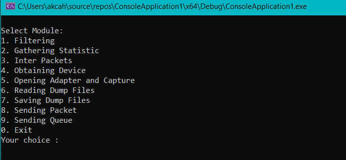
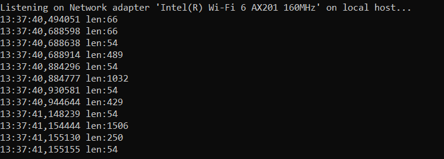
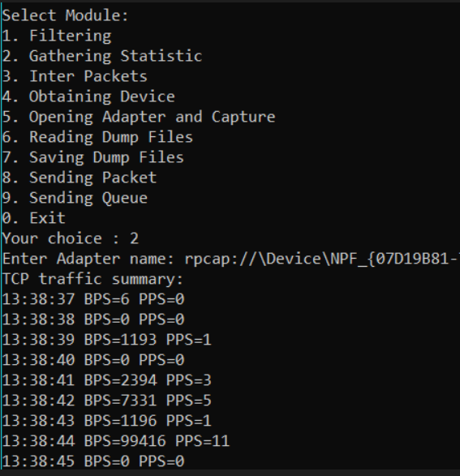
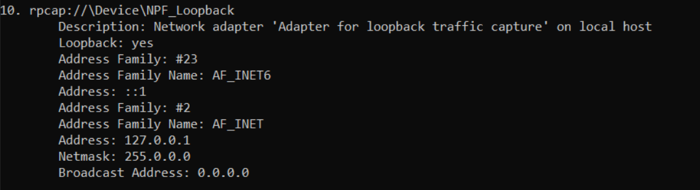
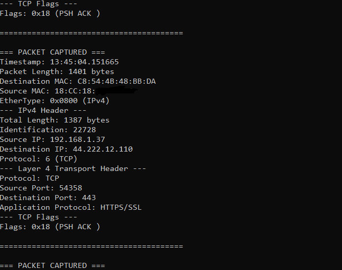
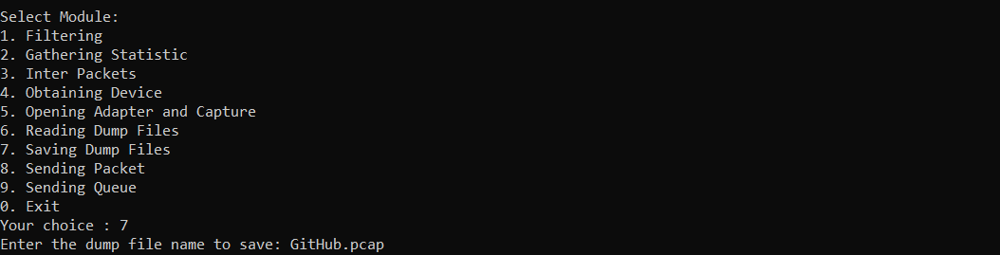
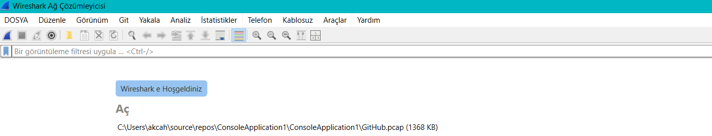
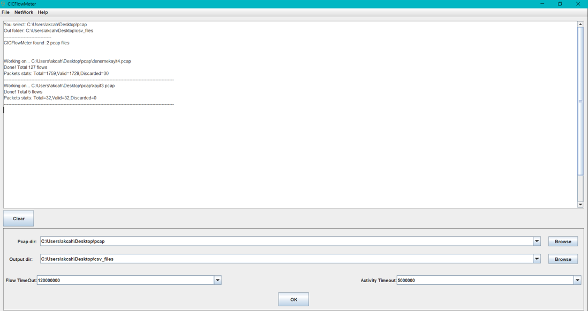

# ConsoleApplication1

Npcap, Nmap Projesi'nin Microsoft Windows için geliştirdiği bir paket yakalama (ve gönderme) kütüphanesidir.  
Açık kaynaklı Pcap API'sini, özel bir Windows çekirdek sürücüsü ve libpcap kütüphanesinin Windows derlemesiyle birlikte uygular.

Bu sayede Windows yazılımları;

kablosuz ağlar,

kablolu Ethernet,

localhost trafiği

ve birçok VPN dahil olmak üzere
ham ağ trafiğini yakalayabilir.

Npcap, yalnızca paket yakalamayı değil, aynı zamanda ham paket göndermeyi de destekler. Ayrıca özel lisans hakları sayesinde, kullanıcılar Npcap'i kendi ürünleriyle birlikte dağıtabilir veya kurum içi sistemlerde topluca kurulum yapabilirler.

## Proje Hakkında

Bu proje, C diliyle geliştirilmiş bir ağ paket analizörüdür. NPcap SDK kullanılarak ağ arayüzlerinden paket yakalama, bu paketleri analiz etme, kaydetme, tekrar oynatma ve çeşitli istatistikler toplama gibi işlemler gerçekleştirir. Proje, özellikle ağ trafiğini incelemek, kaydetmek ve analiz etmek isteyenler için temel bir altyapı sunar.

## Özellikler

- Ağ arayüzlerinden canlı paket yakalama
- Yakalanan paketlerin dosyaya kaydedilmesi (PCAP)
- Kayıtlı PCAP dosyalarının okunması ve analiz edilmesi
- Paketlerin tekrar oynatılması (replay)
- Filtreleme ve istatistik toplama
- UDP paketleriyle ilgili özel işlemler

## Gereksinimler

- **Windows 10/11**
- **Visual Studio 2022** veya uyumlu bir C derleyicisi
- **NPcap SDK** (https://nmap.org/npcap/)
  - `Include` ve `Lib` klasörlerinin yolu projede ayarlanmış olmalı
- Gerekli kütüphaneler: `Packet.lib`, `wpcap.lib`

## Kurulum ve Derleme

1. **NPcap SDK'yı İndirin ve Kurun:**
   - [NPcap SDK](https://nmap.org/npcap/) adresinden indirip kurun.
   - `C:\Users\akcah\Desktop\NPcapSDK\Include` ve `Lib\x64` klasörlerinin mevcut olduğundan emin olun.
   - Farklı bir dizine kurduysanız, proje dosyasındaki yolları güncelleyin.

2. **Projeyi Açın:**
   - Visual Studio ile `ConsoleApplication1.sln` veya doğrudan `.vcxproj` dosyasını açın.

3. **Yapılandırma Seçin:**
   - `Debug | x64` yapılandırmasını seçin (NPcap x64 kütüphaneleri için).

4. **Projeyi Derleyin:**
   - `Build > Build Solution` menüsünden veya `Ctrl+Shift+B` ile derleyin.

## Kullanım

1. **Programı Başlatın:**
   - Derleme sonrası oluşan `ConsoleApplication1.exe` dosyasını çalıştırın.

2. **Temel İşlevler:**
   - Ağ arayüzü seçimi
   - Paket yakalama ve kaydetme
   - Kayıtlı dosyadan paket okuma ve analiz
   - Filtreleme ve istatistik toplama
   - Paket gönderme (replay)

## Dosya Açıklamaları

| Dosya Adı                  | Açıklama                                                                 |
|----------------------------|--------------------------------------------------------------------------|
| ConsoleApplication1.c      | Ana program dosyası, uygulamanın giriş noktası                           |
| Filtering.c / .h           | Paket filtreleme işlemleri                                               |
| GatheringStatistic.c / .h  | İstatistik toplama fonksiyonları                                         |
| InterPacketsUDP.c          | UDP paketleriyle ilgili işlemler                                         |
| ObtainingDevice.c / .h     | Ağ arayüzlerinin tespiti ve seçimi                                       |
| OpeningAdapterAndCapture.c / .h | Ağ adaptörünü açma ve paket yakalama işlemleri                  |
| PacketSender.c / .h        | Paket gönderme (replay) işlemleri                                        |
| ReadingDumpFiles.c / .h    | Kayıtlı PCAP dosyalarını okuma                                           |
| SavingDumpFiles.c / .h     | Yakalanan paketleri dosyaya kaydetme                                     |
| SendingQueue.c / .h        | Gönderilecek paketlerin kuyruğa alınması                                 |
| Packet_analyzer.h          | Paket analiz fonksiyonları (muhtemelen prototipler)                      |
| nfs.pcap                   | Örnek veya test amaçlı büyük bir PCAP dosyası                            |
| kayit3                     | Muhtemelen örnek bir çıktı veya veri dosyası                             |
| xx.c                       | Test veya ek fonksiyonlar içeren dosya                                   |

## Uygulama Arayüzü

## Filtreleme  Örneği

Bu fonksiyon, sistemdeki tüm ağ arayüzlerini listeler ve kullanıcıdan bir arayüz seçmesini ister. Seçilen arayüz üzerinde şu an TCP port 80 (HTTP) trafiğini filtreleyerek yakalar. Gelen paketlerin zaman damgası ve uzunluk bilgilerini ekrana yazdırır.

## TCP Trafik İstatistik Örneği

Bu kod, belirtilen ağ adaptöründen TCP trafiğini istatistiksel olarak toplar ve saniyelik bit/saniye (BPS) ile paket/saniye (PPS) değerlerini ekrana yazdırır.

## Obtaining Device Örneği

Bu kod, bilgisayarda bulunan tüm ağ adaptörlerini (Ethernet, Wi-Fi vb.) listeler ve her adaptörün detaylı bilgilerini (isim, açıklama, IPv4 ve IPv6 adresleri, netmask, broadcast adresi vb.) ekrana yazdırır. Buradaki Loopback arayüzü, bilgisayarın kendi kendisiyle haberleşmesini sağlayan sanal bir ağ arayüzüdür. Fiziksel bir ağ kartı değildir, sadece sistem içi iletişim için kullanılır. 

## Packet Capture Örneği

5. seçenek, bilgisayarınızdaki ağ arayüzlerini listeler, birini seçmenizi sağlar ve seçilen ağ arayüzünden gerçek zamanlı olarak ağ paketlerini yakalar ve detaylı şekilde analiz eder.

Kısaca:

Mevcut ağ cihazlarını bulur ve kullanıcıya listeler.

Kullanıcı seçimiyle seçilen adaptörü açar.

Paketleri tek tek yakalar.

Ethernet başlığı, IP başlığı (IPv4), TCP/UDP/ICMP protokolleri ve ARP paketlerini analiz eder.

Paket içindeki MAC adreslerini, IP adreslerini, port numaralarını ve protokol bilgilerini ekrana detaylı şekilde yazdırır.

HTTP, DNS gibi bazı uygulama protokollerine yönelik özel bilgiler (örneğin TCP bayrakları, HTTP içeriği, DNS başlığı) gösterir.

Hata durumunda bilgi verir.

## Save Örneği

seçilen adaptörden gerçek zamanlı ağ paketlerini yakalar ve bu paketleri belirtilen dosyaya (dump dosyasına) kaydeder. Paketler yakalandıkça, packet_handler fonksiyonu çağrılır ve paketler dosyaya yazılır. Böylece ağ trafiği dosyaya kaydedilmiş olur. Kaydettiğiniz dosyayı bu uygulamadan veya Wireshark kullanarak inceleyebilirsiniz.

## CICFlowMeter

CICFlowMeter, ağ trafiği analizinde kullanılan bir araçtır.

Kısaca:

Ağ akışlarını (flow) çıkarır: Paketleri gruplandırarak aynı iletişim oturumuna ait verileri bir arada toplar.

Özellik çıkarımı yapar: Her ağ akışı için birçok istatistiksel özellik (paket sayısı, byte sayısı, süre, protokol türü vb.) hesaplar.

Siber güvenlik ve saldırı tespiti gibi uygulamalarda kullanılır: Örneğin, makine öğrenmesi modelleri için temiz ve anlamlı veri üretir.

CICIDS2017 gibi veri kümeleri ile uyumludur.  

Kaynak : https://github.com/ahlashkari/CICFlowMeter

## Katkı ve Lisans

Bu proje kişisel veya akademik amaçlarla kullanılabilir. Katkıda bulunmak için lütfen bir pull request gönderin veya issue açın.

## Sorun Giderme

- **Derleme Hatası:** NPcap SDK yollarını ve kütüphanelerini kontrol edin.
- **Çalışma Zamanı Hatası:** Yönetici olarak çalıştırmayı deneyin (ağ arayüzlerine erişim için gerekebilir).
- **Paket Yakalanmıyor:** Doğru ağ arayüzünü seçtiğinizden ve NPcap'in düzgün kurulu olduğundan emin olun.

## İletişim

Herhangi bir soru veya öneriniz için proje sahibiyle iletişime geçebilirsiniz. 
